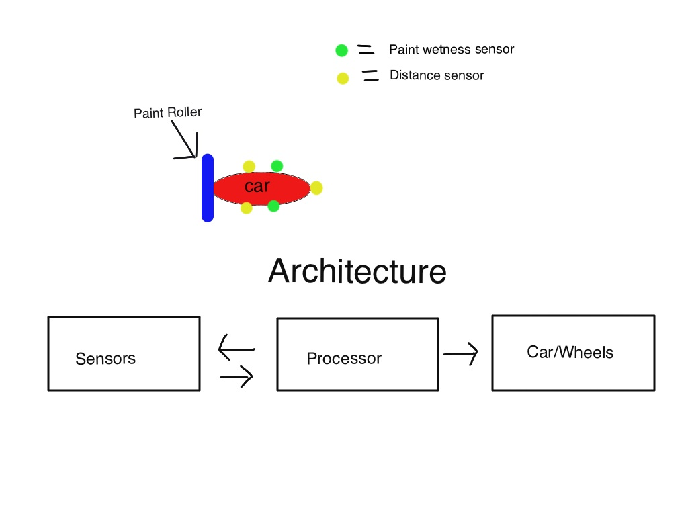
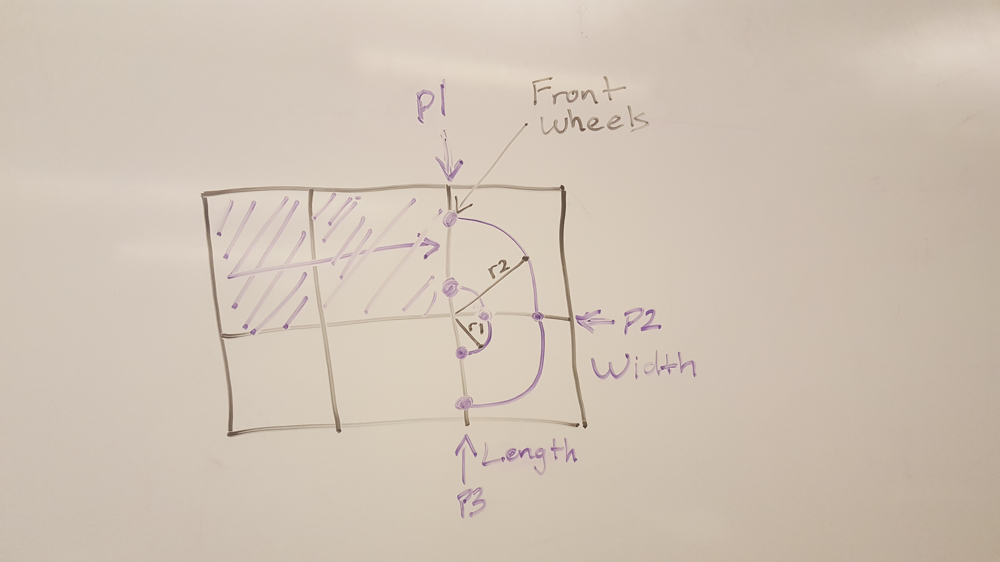

#RC Painter

## Challenge 1:

Paint a kitchen wall Imagine that you have an RC car that is able to roll on walls.
You attach a painting roll and a little reservoir of paint on the car to paint the wall of your kitchen. How would you automate the painting process?

### General assumptions:

You can pick where you initially place the car - There is enough paint in the reservoir to paint the whole wall without refill

### Deliverable:

Think about the type of sensors and processing you would want onboard, as well as an overall idea of your algorithms architecture.

## Assumptions:

1. The wall is rectangular.
2. The paint roller is equal to the width of the car.
3. The paint roller is attached to the back of the car.
4. The car should end near the bottom of the wall so that it can be retrieved.
5. We know the size of the wall and the height and width are greater than 2 times the size of the car.

## Considerations:

1. The car turns around a radius, causing a circular stroke of paint.
2. Any wet paint the car drives over should be repainted.
3. The amount of paint used should be minimized.

## Setup:

The car will have 5 sensors:
* 1 sensor on the front to detect how far from the edge of the wall the car is.
* 2 sensors on either side of the car to measure it's distance from the bottom edge.
  * Returning floating point number representing distance.
* 2 sensors on either side of the car to detect whether paint along it's edge is dry.

## Approach:

### From the perspective of facing the wall.
### 1 unit = width and height of car + paint roller

1. We initially place the car starting at the top left-hand corner of the wall facing the right.

2. The car begins by driving right and turns downward upon getting near the right edge(using a proximity sensor).

3. Every time the car makes a 90 degree turn, it should back up(1 unit) in order to completely paint the unit of wall it used to make the turn.

4. The car then continues another 90 degrees until it is facing the left edge -- once again backs up to completely fill the unit of wall that was used for the turn.

5. As every turn is made, proximity sensors on either side of the vehicle will alert the vehicle upon reaching a distance of less than 2 units from the bottom of the wall.

  * It begins with the proximity sensor on the right of the car measuring the distance and the sensor on it's left to check for dryness of paint, upon turning the sensors switch and the left sensor measures distance and the right measures dryness.

  * If this is the case, the next turn made by the car should result in the car being (distance from wall - 1 unit) from the bottom. This is to ensure that the final path the car takes is the width of the car.

6. Once the car is against the bottom edge of the wall it should stop within one 1 of reaching either the left or right edge depending on which direction the car results in.

7. At this point a sensor should alert the car whether the paint on the wall above the car is dry.

  * Once that paint it dry the car can make it's final maneuver of turning, backing into the corner, then moving forward.

8. The wall is now painted and the car can be retrieved.

## Demo:
Here is a video demonstrating the cars travel path (apologies for the low quality): [Pathing demo](https://www.youtube.com/watch?v=VKIs81gYPeo)

## Possible improvements:

* Make the wheels of the car paint rollers.

* Wheels that rotate allowing the car to strafe.

* Paint shield to prevent unwanted paint on adjacent walls.

## More details:

### Additions:

* We will add one more sensor to the back of the car that measures distance from the edge.
* We will also have a sensor to measure the speed of the car (an encoder).

### Driving and turning mechanism:

1. The car is initially facing horizontally, so to start off, the car will receive a signal to "START" (triggering some "start function in the software")
  * The "START" signal will tell the car to begin accelerating up until a certain speed (let's say 1 unit per second)

2. As the sensor on the front of the car measures its distance from the edge to be 2 units away, the processor will send a signal to "SLOW"(triggering some "slow" function in the software)
  * This will cause the signal to come to a complete stop within 1 unit of the wall (with a breaking mechanism with either pads or counter rotations of the wheels)

3. Once the speed of the car reaches 0, a "TURN" action will be triggered
  * A boolean value will be stored globally to represent whether the vehicle is in it's turn sequence (TURN_SEQUENCE = TRUE). This is to allow the software to know whether it should measure against the width of the wall or the height of the wall (more explained below)
  * This will result in a speed differential between the inside and outside wheels. The outside wheels will accelerate faster than the inside wheels up to a certain speed while the inner wheels should lag behind in order to make the car drive in a parabolic shape(see picture below)

* Purple dot = front wheels
* Car is facing to the right
* P1, P2, P3 = stopping points in the turning
* r1, r2 = turning radius of inside and outside wheels respectively
* Each square represents 1 unit

4. The car will then use both it's proximity sensors on it's front and back
  * If the total distance from the measurement of the front and back sensor + the length of the car equals the height of the wall then it will send a "STOP" signal bringing it to a complete stop

5. As mentioned previously after every 90 degree turn the car would back up. So after the "STOP" signal is terminated, a "REVERSE" signal will be sent -- probably as a callback to the "STOP"
  * The sensor at the back of the car will store it's distance from the wall (BACKING_DISTANCE = back sensor reading), then the car drives back at a constant speed slowing as it's gets close to the wall Once the car stops it will drive forward again until the sensor at the back reads the same distance as it read before going backwards

6. Once again the "TURN" signal is sent. This time the proximity sensors will measure and check against the width of the wall instead of the height

7. The same process is repeated of "STOP" -> "REVERSE"
  * At the end of this reverse method we set TURN_SEQUENCE = FALSE

8. At this point the car should be back at P3 in the picture above with it's left sensor checking if it is against the bottom of the wall or not.
  * If not, then the software commences with the same sequence as above starting with step one except now the software should store a variable to know whether the car is facing left or right. This will determine which sensors data will be used, but the car will always drive forward since it will be facing the direction it is going

  * If yes, then the software will commence with it's final cycle, setting some variable FINAL_CYCLE = TRUE (below):

#### Final Cycle:

9. The car will continue forward with it's usual "START" until it reaches within one unit of the edge it is facing

10. Once at this point the car will remain idle waiting for it's inside paint sensor to detect the paint has dried

11. Once no more wet paint is detected the car will commence with it's final "TURN" sequence which will only proceed with the first 90 degree turn followed by a "REVERSE"

### More considerations:

* The software to run will have to run asynchronously or in parallel with some other function in order to continually update the variables that are being read from the sensors. Javascript provides asynchronous function calls, but other programming languages such as C++ could be used to mimic this effect.
